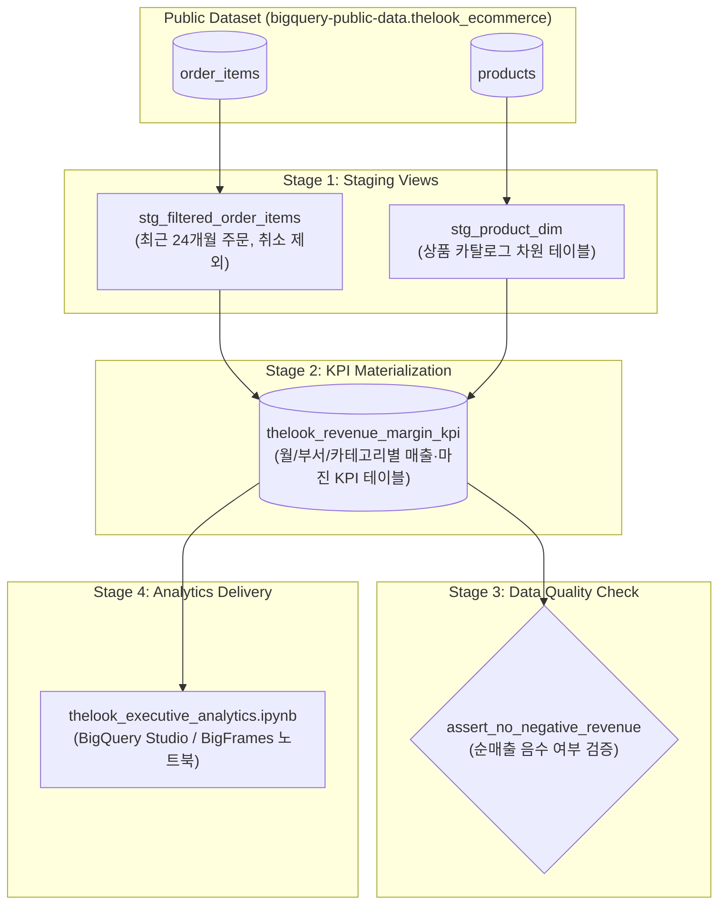

# BigQuery Data Pipelines Demo: TheLook E-Commerce Analytics

이 저장소는 **Google Cloud BigQuery Data Pipelines (Dataform Core 기반) 및 BigQuery Studio Git 연동**을 시연하기 위한 End-to-End 데이터 파이프라인 데모입니다.

BigQuery 공개 데이터셋인 `bigquery-public-data.thelook_ecommerce`의 전자상거래 데이터를 소스로 사용하여 **원시 데이터 정제(Staging) ➔ 핵심 KPI 집계(KPI Table) ➔ 데이터 품질 검증(Assertion) ➔ 임원진 분석 노트북 자동 실행(Notebook)** 까지의 전체 워크플로우를 DAG(Directed Acyclic Graph)로 관리합니다.

---

## 🏗 파이프라인 아키텍처 (DAG)

---

## 📂 단계별 구성 요소

| 단계 | 파일명 | 유형 | 역할 및 설명 |
| :--- | :--- | :--- | :--- |
| **Stage 1** | `definitions/stg_filtered_order_items.sql` | View | 취소(Cancelled) 주문을 제외하고 최근 24개월 데이터만 필터링한 중간 뷰 |
| **Stage 1** | `definitions/stg_product_dim.sql` | View | 상품 ID, 이름, 부서, 카테고리, 원가, 판매가 등을 추출한 상품 차원 뷰 |
| **Stage 2** | `definitions/thelook_revenue_margin_kpi.sql` | Table | 주문과 상품을 조인하여 월/부서/카테고리 단위로 주요 비즈니스 KPI(총매출, 순매출, 매출총이익, 반품률, MoM 성장률)를 집계·구체화(Materialize) |
| **Stage 3** | `definitions/assert_no_negative_revenue.sql` | Assertion | KPI 테이블 내 `net_revenue < 0`인 비정상 행이 있는지 검증 (결과가 1행이라도 있으면 파이프라인 실패 처리) |
| **Stage 4** | `definitions/thelook_executive_analytics.ipynb` | Notebook | BigQuery Studio 및 BigFrames(bpd)를 통해 최종 KPI 테이블을 시각화하고 경영진 인사이트 리포트를 생성 (GCS 버킷으로 출력) |

---

## ⚙️ 설정 파일

### 1. `workflow_settings.yaml`
Dataform 컴파일 및 기본 타겟 환경 설정:
- **Dataform Core 버전**: `3.0.56`
- **대상 프로젝트 / 데이터셋**: `defaultProject: okf-graph-demo`, `defaultDataset: thelook_pipeline_demo`
- **리전**: `US`
- **노트북 런타임 결과물 저장소**: `gs://pipeline-notebook-bucket`
- **테스트(Assertion) 포함 여부**: `includeTestsInCompiledGraph: true`

### 2. `definitions/actions.yaml`
Dataform 액션 정의 파일로 각 SQL/Notebook의 실행 순서, 유형(view, table, assertion, notebook) 및 `dependencyTargets`를 선언하여 의존성 그래프를 구성합니다.

---

## 📊 주요 산출 지표 (KPIs)

- **주문 및 고객 지표**: 총 주문 수(`total_orders`), 활성 고객 수(`active_customers`), 총 판매량(`total_items_sold`)
- **품질/반품 지표**: 반품 건수(`returned_items`), 품목 반품률(`item_return_rate_pct`)
- **재무 및 수익성 지표**: 총 매출(`gross_revenue`), 순 매출(`net_revenue`, 반품액 제외), 매출총이익(`net_gross_margin`), 이익률(`gross_margin_pct`), 전월 대비 매출 성장률(`mom_net_revenue_growth_pct`)

---

## 🚀 실행 및 연동 가이드

1. **BigQuery Studio / Dataform 연동**:
   - Google Cloud Console의 **BigQuery > Dataform** 또는 **BigQuery Studio 코드 저장소**에서 이 Git 저장소를 연결합니다.
2. **워크스페이스 컴파일 및 설정 확인**:
   - `workflow_settings.yaml`의 `defaultProject` 및 `outputBucket`을 실제 사용하는 본인의 GCP 프로젝트 ID와 Cloud Storage 버킷으로 수정합니다.
3. **파이프라인 실행 (Execution)**:
   - 전체 파이프라인을 실행하면 Staging 생성 ➔ Table 구체화 ➔ Assertion 품질 검사 ➔ Notebook 자동 실행 순으로 순차 처리됩니다.
